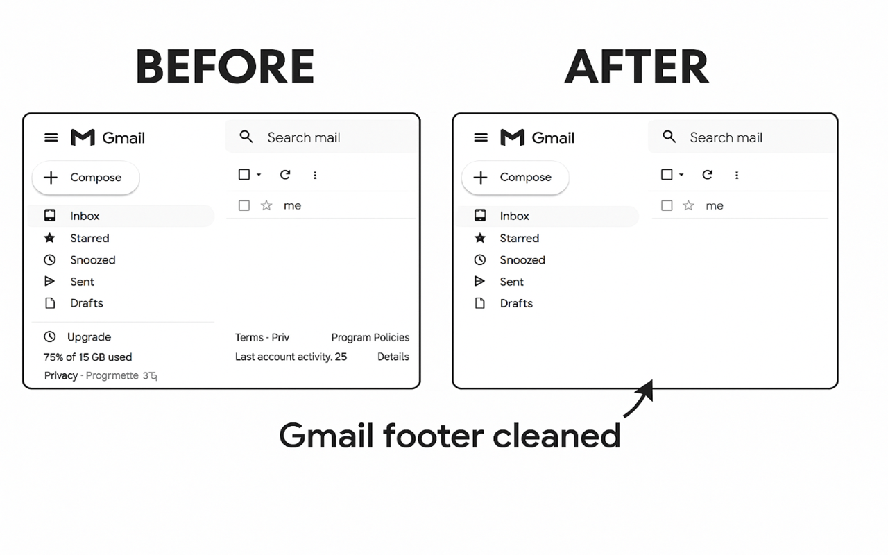
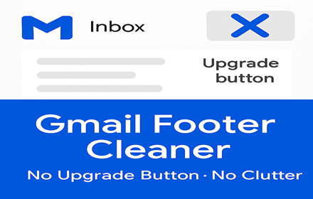

# Gmail Footer Cleaner (Manifest V3)

Automatically hides Gmail’s **“Upgrade button”** and footer clutter (Terms, Privacy, Program Policies, storage meter).

- 🧹 Auto-cleans on every Gmail load
- 🔒 Zero permissions · No tracking · No data collection
- ⚡ Lightweight MV3 content script (<10 KB)

  

  

## Install from source
1) Download ZIP → extract  
2) Go to `chrome://extensions` → enable **Developer mode**  
3) **Load unpacked** → select the folder

## Chrome Web Store
🔗 [Available on the Chrome Web Store](https://chromewebstore.google.com/detail/ljggkifiamlpeiboaeneoailhgaammep?utm_source=item-share-cb)

## Privacy
Runs entirely in your browser; no data is collected or transmitted. See [PRIVACY.md](PRIVACY.md).

## Contributing
PRs welcome! Please see [CONTRIBUTING.md](CONTRIBUTING.md), [CODE_OF_CONDUCT.md](CODE_OF_CONDUCT.md), and [SECURITY.md](SECURITY.md).

## License
MIT © 2025 Amresh Sharma
